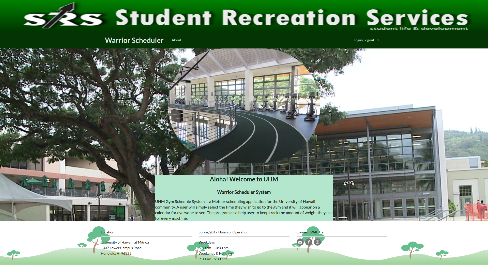

# Table of contents
* [About Warrior Scheduler](#about-warrior-scheduler)
  * [User Guide](#user-guide)
  * [Developer Guide](#developer-guide)
* [Home Page](#home-page)
* [Development history](#development-history)
  * [Milestone 1](#milestone-1)
  * [Milestone 2](#milestone-2)

# About Warrior Scheduler

Warrior Scheduler is a Meteor scheduling application that allows students and faculty to keep track of how busy the gym will be at any given time. A user will simply input the time they wish to go to the gym and it will appear on a calendar for everyone to see. Users will also be able to keep track of the amount of weights they use for each machine.


# User Guide


To log in you must use your UH login.


After logging in, the services will become available.


Use the calendar to add in gym events and workouts.


Fill out your personal information by clicking on the Personal tab.


# Developer Guide
Install Meteor at https://www.meteor.com.

Then, git clone https://github.com/skylite-manoa/warrior-scheduler.git.

In the project, cd into app directory and install libraries with:

```
$ meteor npm install
```

```
$ meteor npm run start
```


# Home Page


# Development History


## Milestone 1

This milestone started on April 6, 2017 and ended on April 13, 2017.

The goal of Milestone 1 was to create the GUI using meteor.
Mockups for the following pages were implemented during M1:


Milestone 1 was implemented as [warrior-scheduler GitHub Milestone M1](https://github.com/skylite-manoa/warrior-scheduler/milestone/1):


Milestone 1 consisted of six issues, and progress was managed via the [warrior-scheduler GitHub Project M1](https://github.com/skylite-manoa/warrior-scheduler/projects/2):


The program was successfully deployed on [galaxy](https://galaxy.meteor.com/app/warrior-scheduler.meteorapp.com)


## Milestone 2
This milestone started on April 14, 2017 and ended on April 27, 2017.

The goal of Milestone 2 is to update all of the mockup pages and add some new implementations.

Milestone 2 was implemented as [warrior-scheduler GitHub Milestone M2](https://github.com/skylite-manoa/warrior-scheduler/milestone/2):


Milestone 2 consisted of five issues, and progress was managed via the [warrior-scheduler GitHub Project M2](https://github.com/skylite-manoa/warrior-scheduler/projects/3):


Version 2 of the program was successfully deployed on [galaxy](https://galaxy.meteor.com/app/warrior-scheduler.meteorapp.com)


## Milestone 3
This milestone started on April 28, 2017 and is ongoing.


