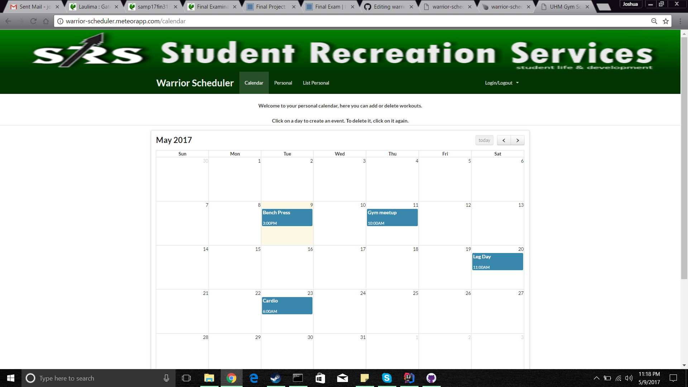
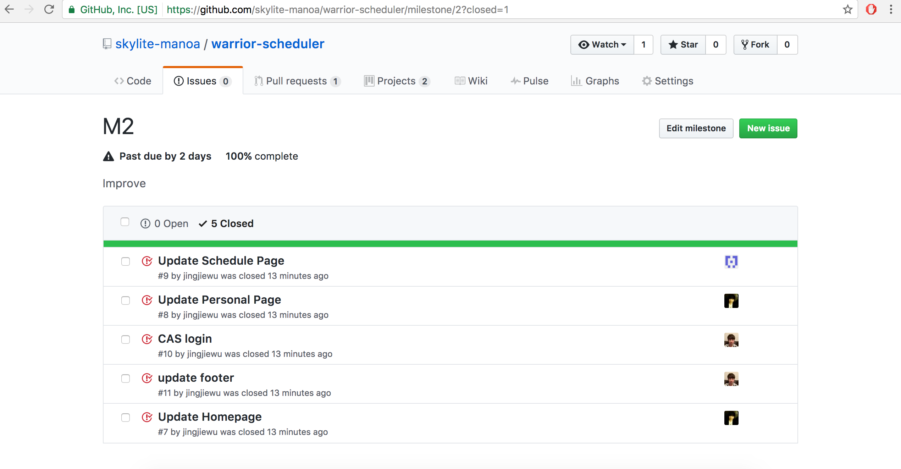

# Table of contents
* [About Warrior Scheduler](#about-warrior-scheduler)
  * [Home Page](#home-page)
  * [User Guide](#user-guide)
  * [Initial User Study](#initial-user-study)
* [Developer Guide](#developer-guide)
* [Application design](#application-design)
  * [Directory structure](#directory-structure)
  * [Import conventions](#import-conventions)
  * [Naming conventions](#naming-conventions)
* [Development history](#development-history)
  * [Milestone 1](#milestone-1)
  * [Milestone 2](#milestone-2)
  * [Milestone 3](#milestone-3)

# About Warrior Scheduler

Warrior Scheduler is a Meteor scheduling application that allows students and faculty to keep track of how busy the gym will be at any given time. A user will simply input the time they wish to go to the gym and it will appear on a calendar for everyone to see. Users will also be able to keep track of the amount of weights they use for each machine.


# Home Page


# User Guide

A working version of this app can be found here [warrior-scheduler app](http://warrior-scheduler.meteorapp.com/)


To log in you must use your UH login.


After logging in, the services will become available.


Use the calendar to add in gym events and workouts.



Fill out your personal information by clicking on the Personal tab.


Your contacts will appear on this page.


# Initial User Study

This Application was tested by 5 different students/alumni of the University of Hawaii at Manoa:
The testers were given access to the warrior-scheduler.meteorapp.com link and were told to provide feedback based on their experience

### User 1 (Major: Public Health):
 "Calendar works fine, didn't see anything wrong with it, color coding would be nice. The personal pages don't seem to work out, maybe make the height and weight optional."
 
### User 2 (Major: Bio, Pre-Med)
 "Events seem to disappear when clicked on and this could be flustering for the user, maybe make an option to delete instead of deleting as soon as it's clicked. As for the Personal Page, I don't think the Height and Weight options are a good choice to have. Some people might not want to give that info away because it might be sensitive for them."
 
### User 3 (Major: Bio, Pre-Nursing)
 "Making the app mobile friendly is a must. The webpage didn't resize to my phone so I found it hard to use on mobile."
 
### User 4 (Major: Electrical Engineering)
 "I liked the calendar, being able to see my planned workouts is a plus. The Personal page could be a bit better, but I can see the potential if more work is put into it."
 
### User 5 (Major: ICS)
"The calendar seemed pretty well done, I would have liked an option to delete rather than just cliking to delete. The personal page could be improved. An option to edit a contact once it's up should be implemented, and a delete option."
 
# Developer Guide
First, [install Meteor](https://www.meteor.com/install).

Second, [download a copy of warrior-scheduler](https://github.com/skylite-manoa/warrior-scheduler), or clone it using git.
  
Third, cd into the app/ directory and install libraries with:

```
$ meteor npm install
$ meteor npm install autoprefixer
```

Fourth, run the system with:

```
$ meteor --settings ../config/settings.development.json
```

If all goes well, the application will appear at [http://localhost:3000](http://localhost:3000). If you have an account on the UH test CAS server, you can login.

# Application Design

## Directory structure

The top-level directory structure contains:

```
app/        # holds the Meteor application sources
config/     # holds configuration files, such as settings.development.json
.gitignore  # don't commit IntelliJ project files, node_modules, and settings.production.json
```

This structure separates configuration files (such as the settings files) in the config/ directory from the actual Meteor application in the app/ directory.

The app/ directory has this top-level structure:

```
client/
  lib/           # holds Semantic UI files.
  head.html      # the <head>
  main.js        # import all the client-side html and js files. 

imports/
  api/           # Define collection processing code (client + server side)
    base/
    interest/
    profile/
  startup/       # Define code to run when system starts up (client-only, server-only)
    client/        
    server/        
  ui/
    components/  # templates that appear inside a page template.
    layouts/     # Layouts contain common elements to all pages (i.e. menubar and footer)
    pages/       # Pages are navigated to by FlowRouter routes.
    stylesheets/ # CSS customizations, if any.

node_modules/    # managed by Meteor

private/
  database/      # holds the JSON file used to initialize the database on startup.

public/          
  images/        # holds static images for landing page and predefined sample users.
  
server/
   main.js       # import all the server-side js files.
```

## Import conventions

This system adheres to the Meteor 1.4 guideline of putting all application code in the imports/ directory, and using client/main.js and server/main.js to import the code appropriate for the client and server in an appropriate order.

This system accomplishes client and server-side importing in a different manner than most Meteor sample applications. In this system, every imports/ subdirectory containing any Javascript or HTML files has a top-level index.js file that is responsible for importing all files in its associated directory.   

Then, client/main.js and server/main.js are responsible for importing all the directories containing code they need. For example, here is the contents of client/main.js:
```
put directory here
```
Apart from the last line that imports style.css directly, the other lines all invoke the index.js file in the specified directory.

We use this approach to make it more simple to understand what code is loaded and in what order, and to simplify debugging when some code or templates do not appear to be loaded.  In our approach, there are only two places to look for top-level imports: the main.js files in client/ and server/, and the index.js files in import subdirectories. 

Note that this two-level import structure ensures that all code and templates are loaded, but does not ensure that the symbols needed in a given file are accessible.  So, for example, a symbol bound to a collection still needs to be imported into any file that references it. 

# Development History


## Milestone 1

This milestone started on April 6, 2017 and ended on April 13, 2017.

The goal of Milestone 1 was to create the GUI using meteor.
Mockups for the following pages were implemented during M1:


Milestone 1 was implemented as [warrior-scheduler GitHub Milestone M1](https://github.com/skylite-manoa/warrior-scheduler/milestone/1):


Milestone 1 consisted of six issues, and progress was managed via the [warrior-scheduler GitHub Project M1](https://github.com/skylite-manoa/warrior-scheduler/projects/2):


The program was successfully deployed on [galaxy](https://galaxy.meteor.com/app/warrior-scheduler.meteorapp.com)


## Milestone 2
This milestone started on April 14, 2017 and ended on April 27, 2017.

The goal of Milestone 2 is to update all of the mockup pages and add some new implementations.

Milestone 2 was implemented as [warrior-scheduler GitHub Milestone M2](https://github.com/skylite-manoa/warrior-scheduler/milestone/2):



Milestone 2 consisted of five issues, and progress was managed via the [warrior-scheduler GitHub Project M2](https://github.com/skylite-manoa/warrior-scheduler/projects/3):


Version 2 of the program was successfully deployed on [galaxy](https://galaxy.meteor.com/app/warrior-scheduler.meteorapp.com)


## Milestone 3
This milestone started on April 28, 2017 and has ended on May 9th, 2017.

The main goal for Milestone 3 was to get our Calendar working and getting the Personal page to store contacts in the database

Milestone 3 was implemented as [warrior-scheduler GitHub Milestone M3](https://github.com/skylite-manoa/warrior-scheduler/milestone/3):


Milestone 3 consisted of 2 issues, and progress was managed via the [warrior-scheduler GitHub Project M3](https://github.com/skylite-manoa/warrior-scheduler/projects/5):


Version 7 of the program was successfully deployed on [galaxy](https://galaxy.meteor.com/app/warrior-scheduler.meteorapp.com)


Commits were tracked via the [warrior-scheduler GitHub Project M3](https://github.com/skylite-manoa/warrior-scheduler/network):


